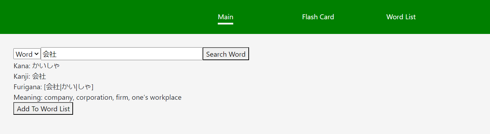
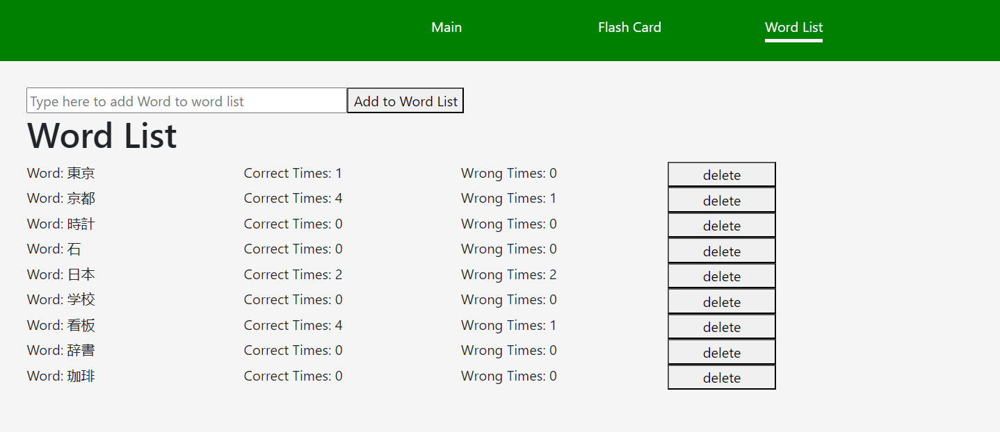
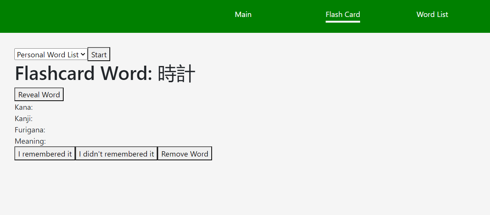
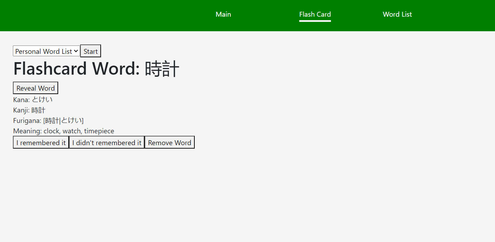
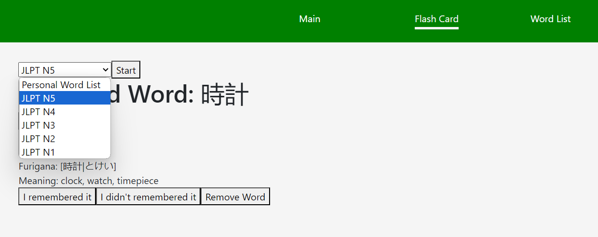
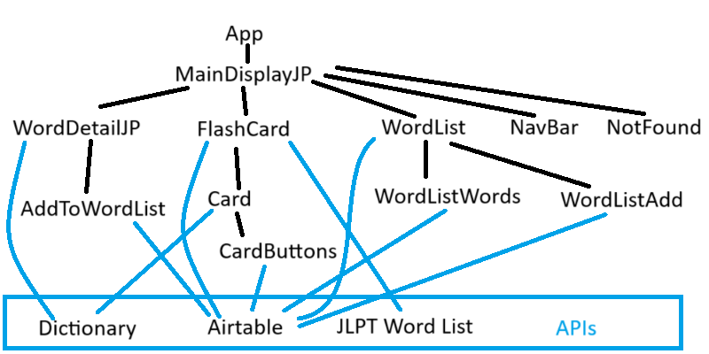

# GAproject2 (Japanese Dictionary and Flash card React App)

GA Project 2 Japanese Dictionary and Flash card React App by Kevin

## Japanese Dictionary and Flash card

This is Japanese Dictionary and Flash card React App. I honestly didn't know what I wanted to do for project 2 so I decided to make something that I would use personally. I have completed only the most basic JLPT test (N5) in 2022 December. I do hope to take the higher grade test in the future but it isn't a huge priority.

### Screenshot(s):

**_Main Page_**

Type a word to search. Add the word to your own personal word list.

Your own personal word list. Delete or add more words.

Pick a word from your own personal word list and test yourself.

Reveal the word and edit the points in your word list.

Pick words from a JLPT word list.

Reveal the word.

### Wireframe:

Wireframe of app

### Technologies Used:

React, JavaScript, HTML, CSS
(Starter code and Full-react-app from General Assembly.)

#### APIs used:

- [Jotoba Dictionary API](https://jotoba.de/docs.html)
- [JLPT Vocabulary API](https://jlpt-vocab-api.vercel.app/)
- [Airtable API](https://airtable.com/)

#### Resources:

- [W3Schools](https://www.w3schools.com/js/)
- [Mozilla Developer Documentation](https://developer.mozilla.org/en-US/docs/Learn/Tools_and_testing/Client-side_JavaScript_frameworks/React_getting_started)

### How to use:

Open the HTML file and run the React App. Click on it to start.
Main page is a dictionary page and allows you to search the word. Flash Card allows you to test yourself from different word lists. Word list is your own personal word list that you've added.

### Planned future enhancements (icebox items).

- Add more languages and more users.
- Use modal to edit counts in user's word list.
- More information like Kanji readings and pitch.
- Darkmode.
- Link in word list to search the word.
